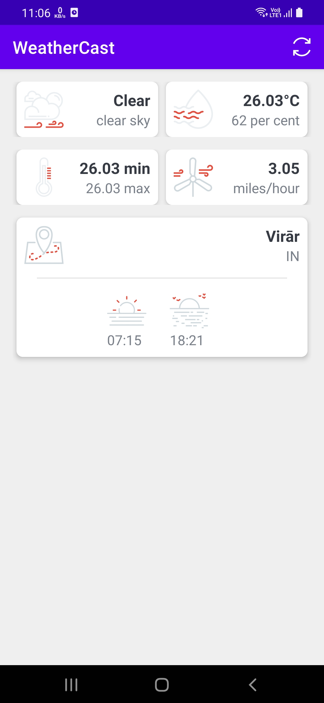

# WeatherCast

Weather Cast fetches weather data from OpenWeatherMap API based on user's current location.

Handles UI as per retrieved weather data.

 
 

<table>
  <tr>
    <td></td>
  </tr>
 </table>
